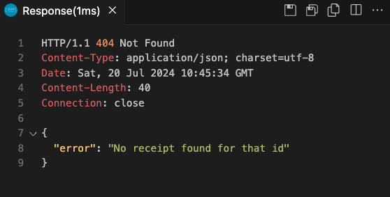

# Receipt Processor

## Description

This project provides a web service for processing receipts and calculating points based on predefined rules. It is designed to handle various types of receipts and can be utilized in scenarios where transaction analysis and customer rewards calculation are required.

## Features

- **API Endpoints:** Two main endpoints for processing receipts and retrieving awarded points.
- **Flexible Input:** Accepts JSON formatted receipts through a RESTful API.
- **Scalable Calculation Logic:** Implements a set of rules to calculate points that can be adjusted as needed.

## Requirements

- **Go:** Go 1.16 or higher.
- **Environment:** Suitable for both Windows\MacOS\Linux operating systems.

## Installation

To get the project up and running on your local machine for development and testing purposes, follow these steps:

```bash
git clone https://github.com/yourgithub/receipt-processor.git
cd receipt-processor
```

## Usage

To run the server, you can choose between two implementations (naive or gin) by passing an argument when starting the server:

```bash
go build
go run receipt-processor.go naive # For the basic implementation without external frameworks.
go run receipt-processor.go gin   # For the implementation using the Gin framework.
```

## API Endpoints

### POST `/receipts/process`

- Description: Submits a receipt for processing.
- Payload: JSON formatted receipt.
- Response: JSON object containing the receipt ID.

### GET `/receipts/{id}/points`

- Description: Retrieves the points awarded to the receipt.
- Response: JSON object showing the number of points.

## Testing

I was testing using a VSCode extension called `REST Client`. Simply create a `test.http` file and click `Send Request` in VSCode. It will display the results for you.




